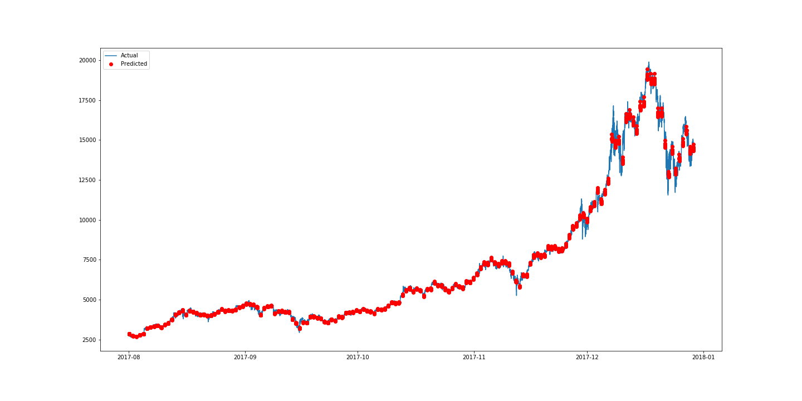
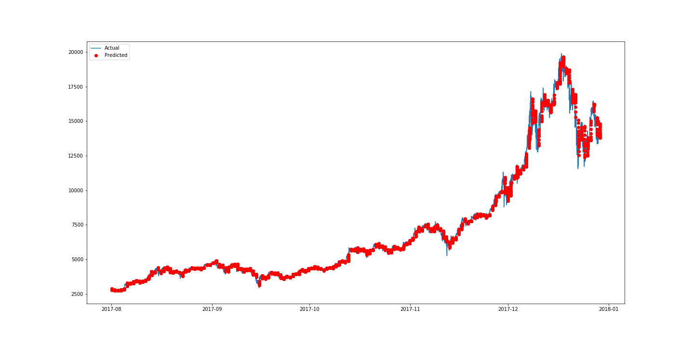
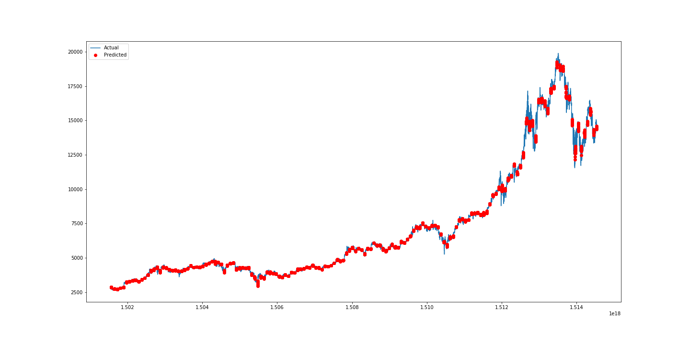
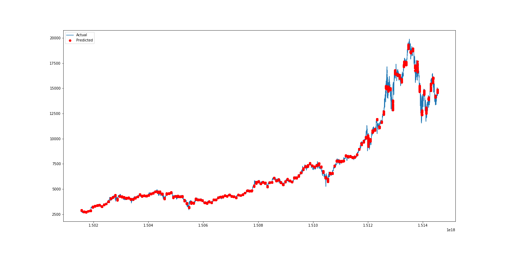

# Deep Learning for Cryptocurrency Price Prediction
<div float="left">
  
  
</div>
<div float="right">

</div>

## 

### Introduction
This repo makes use of the state-of-art Deep Learning algorithm to predict the price of Bitcoin, which has the potential to generalize to other cryptocurrency. It leverages models such as CNN and RNN implemented by [Keras](https://github.com/keras-team/keras) running on top of [Tensorflow](https://github.com/tensorflow/tensorflow). You can find more detailed illustration in this [blog post](https://blog.goodaudience.com/predicting-cryptocurrency-price-with-tensorflow-and-keras-e1674b0dc58a).

### Getting Started
To run this repo, be sure to install the following environment and library:

1. Python 2.7
2. Tensorflow=1.2.0
3. Keras=2.1.1
4. Pandas=0.20.3
5. Numpy=1.13.3
6. h5py=2.7.0
7. sklearn=0.19.1

### File Illustration
#### There are currently three different models:
1. LSTM.py
2. GRU.py
3. CNN.py (1 dimensional CNN)

#### The validation result is plotted in:
1. Plot_LSTM.ipynb
2. Plot_GRU.ipynb
3. Plot_CNN.ipynb

#### Data is collected from [poloniex](https://poloniex.com) and parse to h5py file:
1. DataCollection.ipynb
2. PastSampler.ipynb

### Run
To run the prediction model, select one of the model. For instance, 
```
python CNN.py
```
To run iPython file, you need to run jupyter notebook
```
jupyter notebook
```
__Be sure to run DataCollection.ipynb and PastSampler.ipynb first to create database for training models.__
### Input & Output & Loss
The input consists of a list of past Bitcoin data with step size of 256.
The output is the predicted value of the future data with step size of 16. Note that since the data is ticked every five minutes, the input data spans over the past 1280 minutes, while the output cover the future 80 minutes. The datas are scaled with MinMaxScaler provided by sklearn over the entire dataset. The loss is defined as Mean Square Error (MSE).

### Result
|Model | #Layers  |  Activation    | Validation Loss   |Test Loss (Scale Inverted) |
|----------| ------------- |------|-------| -----|
|   CNN    | 2       | ReLU       |    0.00029     | 114308 |
|   CNN    | 2       | Leaky ReLU       |    0.00029     | 115525 |
|   CNN    | 3       | ReLU       |    0.00029     | 201718 |
|   CNN    | 3       | Leaky ReLU       |    0.00028     | 108700 |
|   CNN    | 4       | ReLU       |    0.00030     | 117947 |
|   CNN    | 4       | Leaky ReLU       |    0.03217     | 12356304 |
|   LSTM    | 1      | tanh + ReLU       |    0.00007     | 26649 |
|   LSTM    | 1      | tanh + Leaky ReLU       |    0.00004     | 15364 |
|   GRU    | 1      | tanh + ReLU       |    0.00004     | 17667 |
|   GRU    | 1      | tanh + Leaky ReLU       |    0.00004     | 15474 |
|   Baseline (Lag)    | -     | -       |    -     | 19122 |
|   Linear Regression   | -     | -       |    -     | 19789 |


Each row of the above table is the model that derives the best validation loss from the total 100 training epochs. From the above result, we can observe that LeakyReLU always seems to yield better loss compared to regular ReLU. However, 4-layered CNN with Leaky ReLU as activation function creates a large validation loss, this can due to wrong deployment of model which might require re-validation. CNN model can be trained very fast (2 seconds/ epoch with GPU), with slightly worse performance than LSTM and GRU. The best model seems to be LSTM with tanh and Leaky ReLU as activation function, though 3-layered CNN seems to be better in capturing local temporal dependency of data.
<div align="center">
	
</div>

_LSTM with tanh and Leaky ReLu as activation function._

<div align="center">
	
</div>

_3-layered CNN with Leaky ReLu as activation function._

<div align="center">
	
</div>

_Baseline_

<div align="center">
	
</div>

_Linear Regression_

## Update
Regularization has been done, which can be viewed in PlotRegularization.ipynb.
